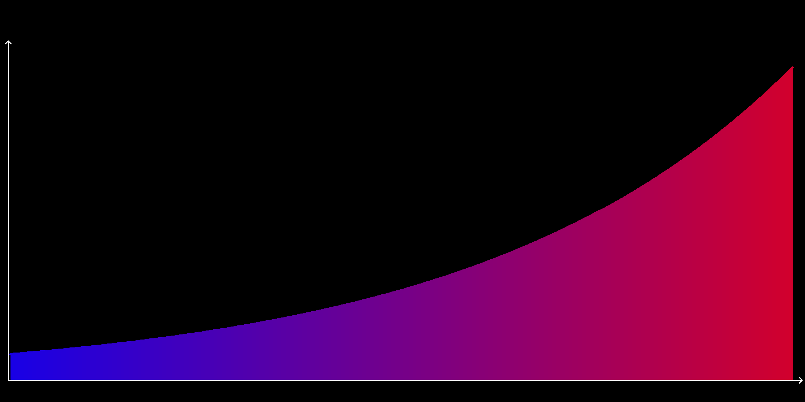

# Graphic Integrator

Graphic Integrator is a Python/Swift tool I've developed as a part of my university project. 

It allows the user to integrate a preset function on a given interval and see the dynamic of how the function covers its area on a plane.

The additional script, [gradients.py](Dev/gradients.py), generates beautiful gradients that the main script further uses to fill the area covered by the function.

## License
[MIT](https://choosealicense.com/licenses/mit/)
